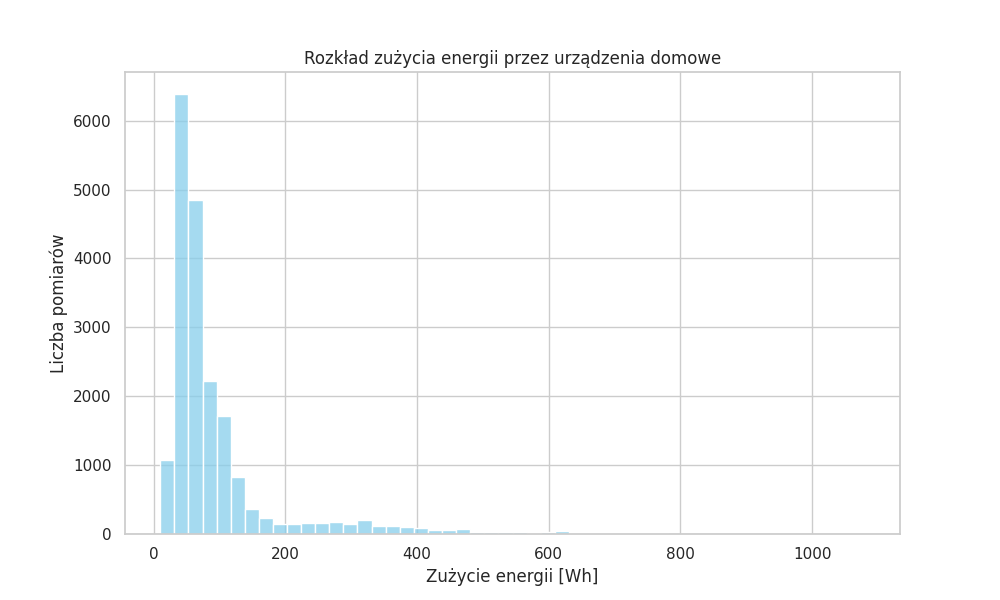
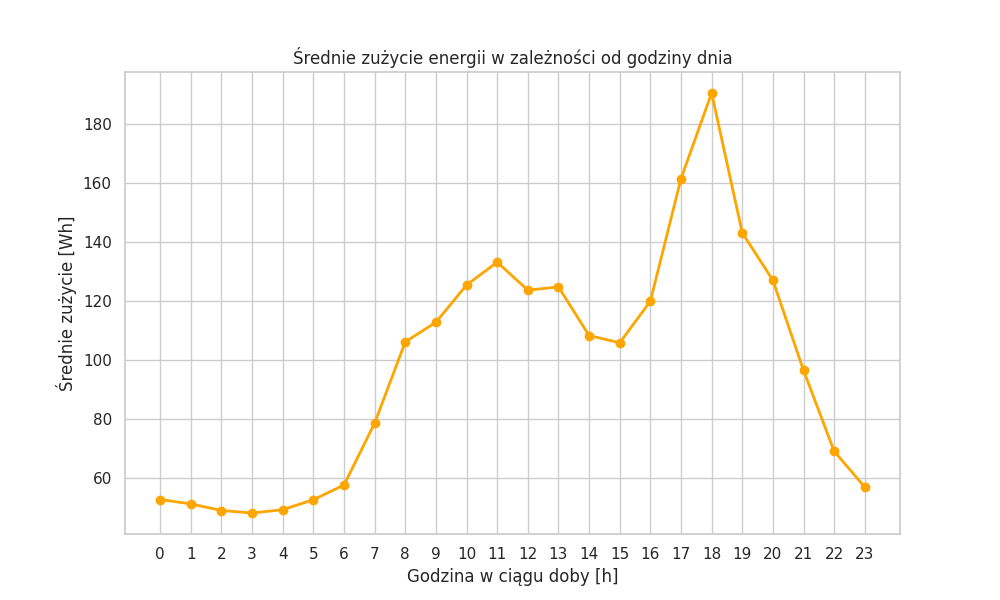
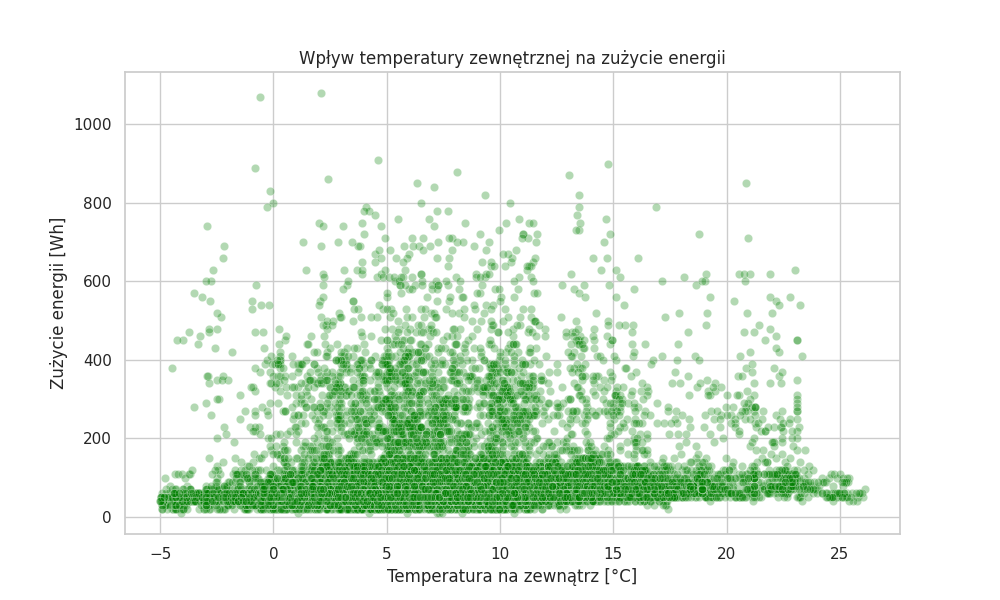
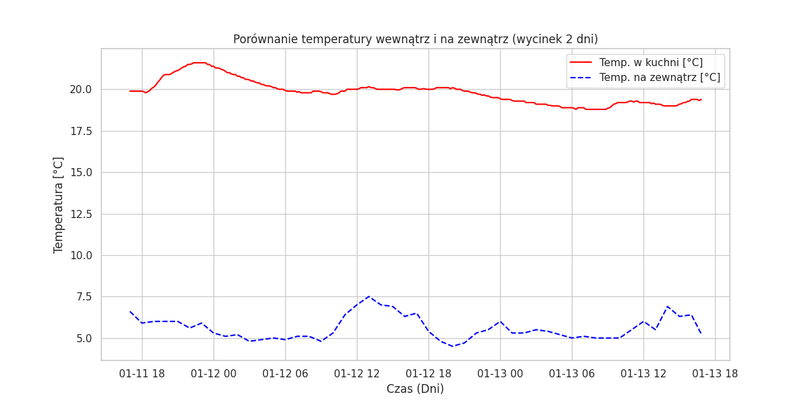
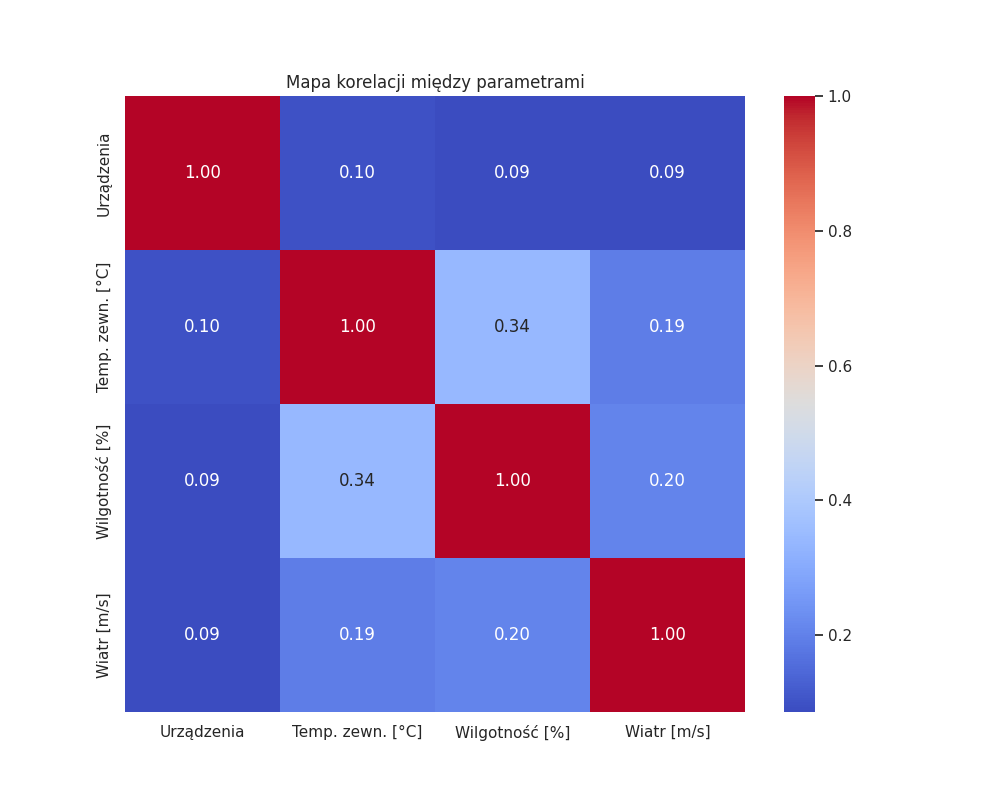

# Sprawozdanie: Analiza zużycia energii w gospodarstwie domowym

**Cel zadania:** Eksploracja danych dotyczących zużycia energii oraz warunków pogodowych w celu znalezienia wzorców i zależności.

---

## 1. Rozkład zużycia energii

**Wnioski:** Większość czasu zużycie energii utrzymuje się na stałym, niskim poziomie (poniżej 100 Wh). Wysokie skoki zużycia zdarzają się rzadko, co sugeruje, że urządzenia o dużej mocy (np. pralka, piekarnik) pracują stosunkowo krótko, a dom "w spoczynku" pobiera mało prądu.

## 2. Profil dobowy zużycia prądu

**Wnioski:** Na wykresie wyraźnie widać dwa szczyty aktywności domowników: mniejszy w godzinach porannych oraz główny szczyt wieczorny (między 17:00 a 20:00). W nocy zużycie spada do niezbędnego minimum.

## 3. Wpływ temperatury zewnętrznej na zużycie energii

**Wnioski:** Wykres punktowy jest mocno rozproszony. Oznacza to, że sama temperatura na zewnątrz nie determinuje jednoznacznie tego, ile prądu zużywa dom. Większe znaczenie mają prawdopodobnie codzienne nawyki mieszkańców i cykl dobowy.

## 4. Ocena izolacji termicznej budynku

**Wnioski:** Wybrano wycinek 48 godzin, aby wykres był czytelny. Mimo zauważalnych wahań temperatury zewnętrznej w cyklu dzień/noc, temperatura wewnątrz (w kuchni) pozostaje bardzo stabilna. Świadczy to o dobrej izolacji termicznej budynku.

## 5. Mapa korelacji między wybranymi parametrami

**Wnioski:** Wartości bliskie 0 oznaczają brak powiązania, a bliskie 1 silne powiązanie. Z wykresu wynika, że samo zużycie energii (`Appliances`) ma bardzo słabą korelację z czynnikami pogodowymi (np. wiatr czy temperatura na zewnątrz).